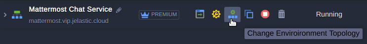
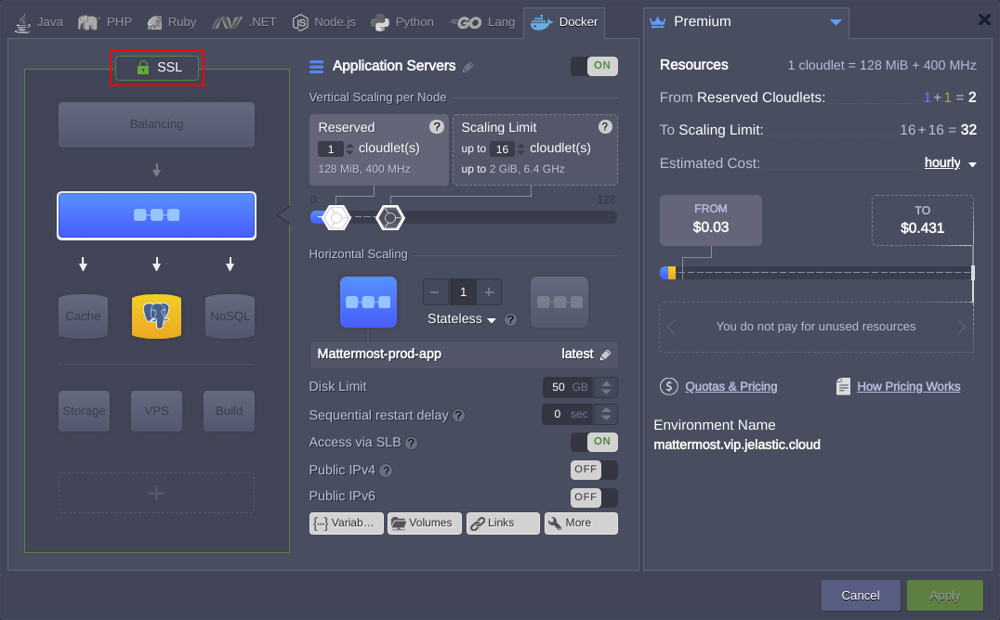
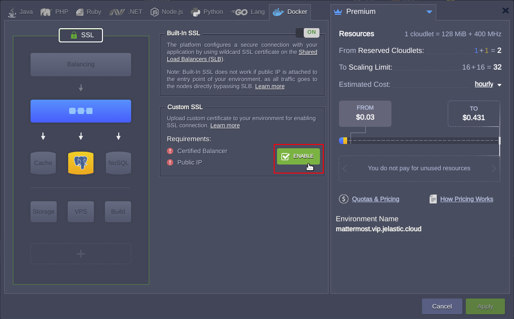
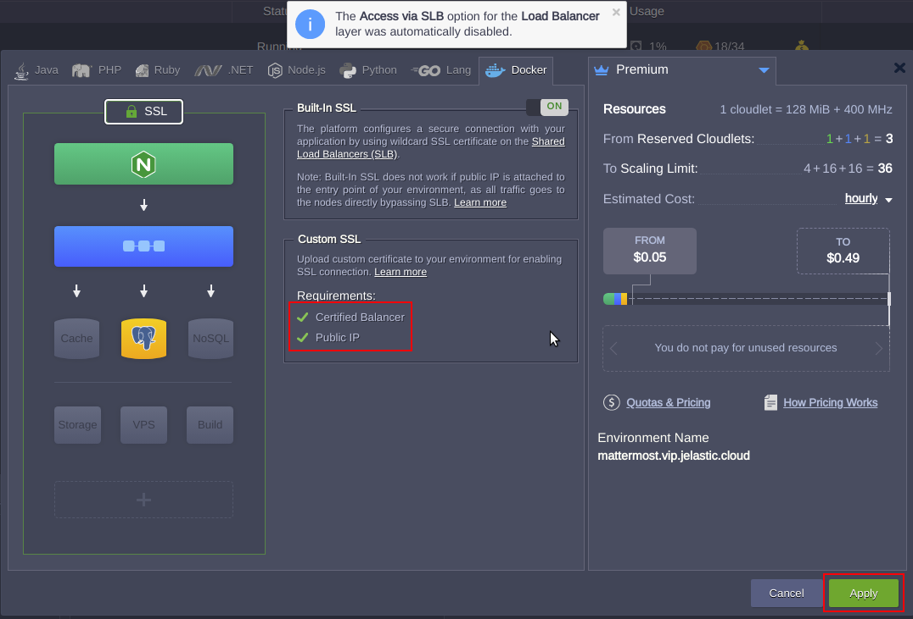
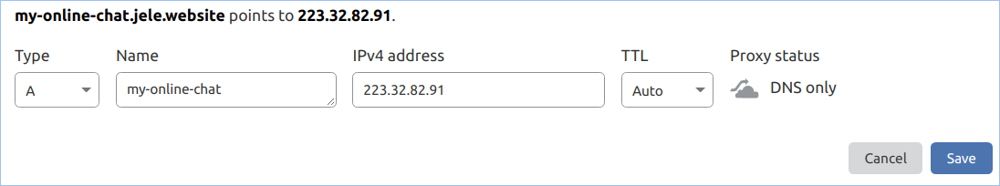
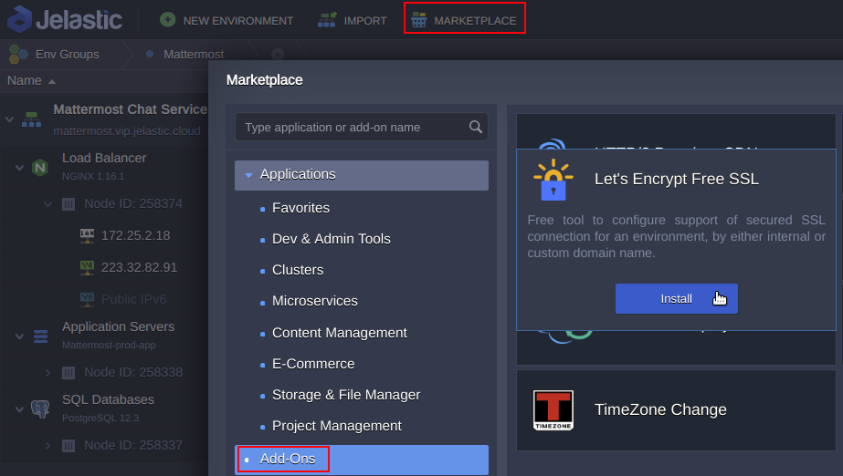
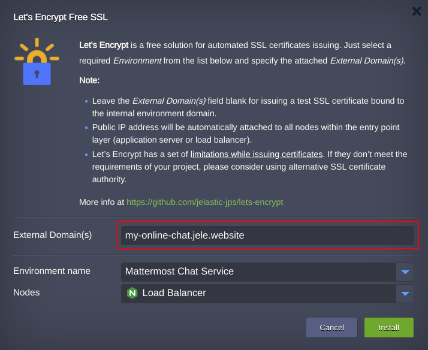
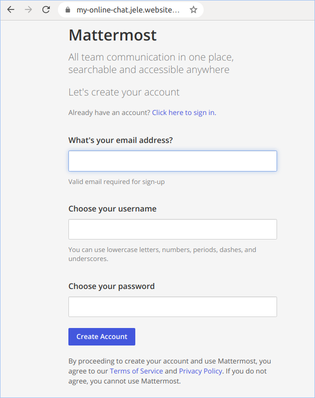

# Mattermost

**Mattermost** is an open-source, self-hostable online chat service with file sharing, search, and integrations. It is focused on ensuring communication between developers and employees of enterprises. The server-side code of the project is written in Go and is distributed under the MIT license. The web interface and mobile applications are written in JavaScript using React, the desktop client for Linux, Windows and macOS is built on the Electron platform. MySQL and Postgres can be used as a DBMS. Easy to deploy, manage, and upgrade – Mattermost may be run as Linux binary or Docker image. Here we use the image with PostgreSQL node added to the environment.

Mattermost is positioned as an open alternative to the Slack communications system and allows you to receive and send messages, files and images, track the history of conversations and receive notifications on your smartphone or PC. Slack-ready integrations are supported, and a large collection of native modules are provided to integrate with Jira, GitHub, IRC, XMPP, Hubot, Giphy, Jenkins, GitLab, Trac, BitBucket, Twitter, Redmine, SVN and RSS.
.  

## Installation

Get your Jelastic account at any of available [hosting provider](https://jelastic.cloud/).

Click the **DEPLOY TO JELASTIC** button, specify your email address within the widget and press **Install**.

<a href="https://jelastic.com/install-application/?manifest=https://raw.githubusercontent.com/jelastic-jps/mattermost/master/mattermost.yaml">

</a>  
      
> **Note:** If you are already registered at Jelastic, you can deploy this cluster by importing the  [package manifest raw link](https://raw.githubusercontent.com/jelastic-jps/mattermost/master/mattermost.yaml).  

If required change **Environment** Name and Destination **Region**.

Once the installation is completed you may proceed to the initial setup **URL** of your Chat System by pressing **Open in Browser** button in a successful installation window.  

Right after setup is finished, create your teams, channels(e.g. Marketing) and start using online Chat.

### Custom Domain Binding

In case you are in need to put your online chat in production a [custom domain](https://docs.jelastic.com/custom-domains/) is obviuosly should be bound to it along with trusted SSL certificate generated. Keep in mind that the mobile applications are most strict with respect to certificate validity.
There are just few actions required to be conducted to ensure your application as production ready:
  1. Add a dedicated [load balancer](https://docs.jelastic.com/load-balancing/) with [public IP](https://docs.jelastic.com/public-ip/) address to you your environment in front of application node. Click on **[Change Environment Topology](https://docs.jelastic.com/setting-up-environment/)**.
  

Then press **SSL**.

After that click on **Enable** button that will add a certified load balancer and public IP address to your environment.

 

And finally  **Apply** the changes.

 

From now on traffic will be directly routed to your environment's public IP address attached to the load balancer node. 

  2. Create an [A record](https://docs.jelastic.com/custom-domains/) at your domain registrar with a custom domain you prefer bound to public IP address attached to load balancer.
  
For example let's create A record for custom domain **my-online-chat.jele.website**.

 

  3. The last step is to issue a trusted SSL certificate for new custom domain. In Jelastic it may done with [Let's Encrypt SSL Add-On](https://jelastic.com/blog/free-ssl-certificates-with-lets-encrypt/) that can be found in the [Marketplace](https://docs.jelastic.com/marketplace/).
  

 

Put custom domain into respective field. And press Install.

 

  4. Open you application by new URL: **https://my-online-chat.jele.website** and make sure the application is workable and traffic encrypted with valid SSL certificate.
  

 

  
  Congratulation! There were taken only three simple steps to get your Online Chat system moved to production mode.
