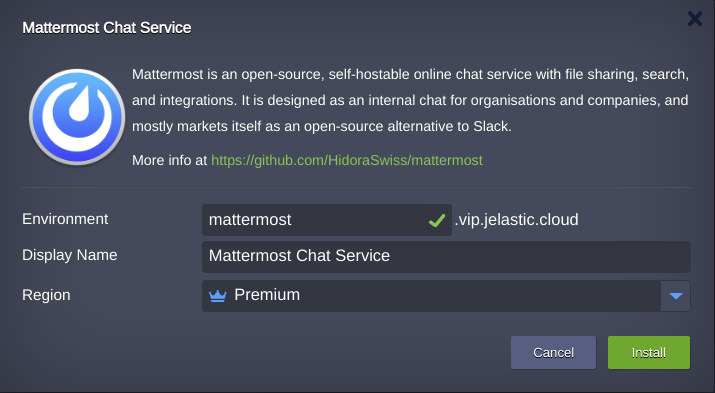
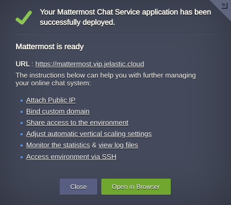
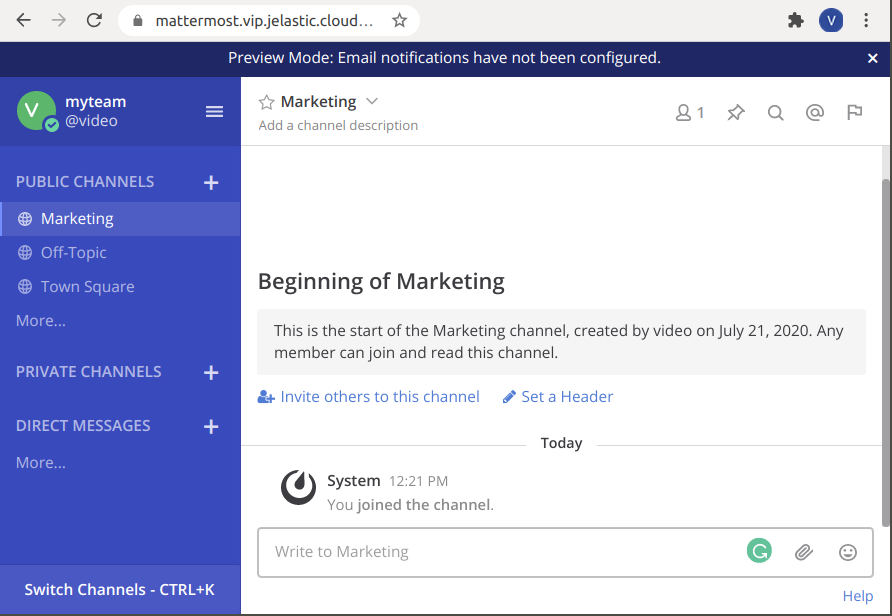

# Mattermost

**Mattermost** is an open-source, self-hostable online chat service with file sharing, search, and integrations. It is focused on ensuring communication between developers and employees of enterprises. The server-side code of the project is written in Go and is distributed under the MIT license. The web interface and mobile applications are written in JavaScript using React, the desktop client for Linux, Windows and macOS is built on the Electron platform. MySQL and Postgres can be used as a DBMS. Easy to deploy, manage, and upgrade – Mattermost may be run as Linux binary or Docker image. Here we use the image with PostgreSQL node added to the environment.

Mattermost is positioned as an open alternative to the Slack communications system and allows you to receive and send messages, files and images, track the history of conversations and receive notifications on your smartphone or PC. Slack-ready integrations are supported, and a large collection of native modules are provided to integrate with Jira, GitHub, IRC, XMPP, Hubot, Giphy, Jenkins, GitLab, Trac, BitBucket, Twitter, Redmine, SVN and RSS.
.  

## Installation

Get your Jelastic account at any of available [hosting provider](https://jelastic.cloud/).

Click the **DEPLOY TO JELASTIC** button, specify your email address within the widget and press **Install**.

> **Note:** If you are already registered at Jelastic, you can deploy this cluster by importing the  [package manifest raw link](https://raw.githubusercontent.com/jelastic-jps/mattermost/master/mattermost.yaml).  

If required change **Environment** Name and Destination **Region**.

Once the installation is completed you may proceed to the initial setup **URL** of your Chat System by pressing **Open in Browser** button in a successful installation window.  

Right after setup is finished, create your channels(e.g. Marketing) and start using online Chat.

